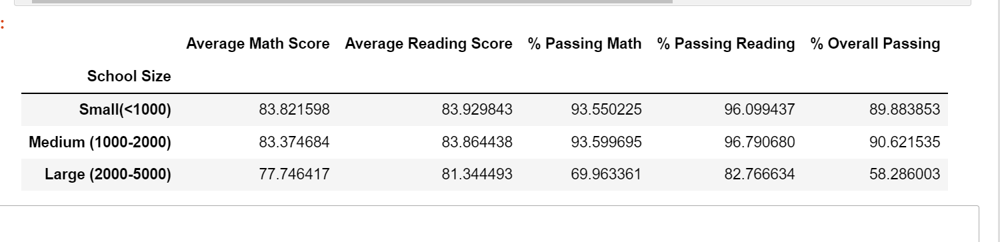

# Pandas-PyCity Challenge

For data manipulation and anaylysis in python , we use pandas. It is the software library for python.  This module assignment would be a display of most of that we have learned in our module. This assignment is about creating and manipulating Pandas dataframe to analyze school and standardized test data. We need to help the school board and mayor to make strategic decisions regarding future school budgets and priorities. We've been provided access to every student's math and reading scores and other information on the schools that they attend. Our task is to aggregate the data to showcase the obvious trends in school performance. 

## Configuration:

Inorder to have a clean and organized project we would need to do the following: 

  * Create a new repository, name it as pandas-challenge and clone it to our computer.  

  * Inside our local Git repository, create a folder and name it as PyCitySchools.

  * The main script for running analysis will be a jupyter notebook, add it to this folder.

  * Finally, once we've completed our changes. We need to push these changes to GitHub or GitLab.

## Procedure to Establish the Following DataFrame Summaries and Tables:

### District Summary
We would generate a DataFrame that includes the district's key metrics and in addition, the following:

* Total schools 
* Total students
* Total budget
* Average math score
* Average reading score
* % passing math (the percentage of students who passed math)
* % passing reading (the percentage of students who passed reading)
* % overall passing (the percentage of students who passed math AND reading)

### School Summary
We will generate a DataFrame that summarizes key metrics about each school, including the following:

* School name
* School type
* Total students
* Total school budget
* Per student budget
* Average math score
* Average reading score
* % passing math (the percentage of students who passed math)
* % passing reading (the percentage of students who passed reading)
* % overall passing (the percentage of students who passed math AND reading)

### Highest-Performing Schools (by % Overall Passing)

We need to generate a DataFrame that highlights the top 5 performing schools based on % Overall Passing. Inorder to do that we need to find the following metrics:

* School name
* School type
* Total students
* Total school budget
* Per student budget
* Average math score
* Average reading score
* % passing math (the percentage of students who passed math)
* % passing reading (the percentage of students who passed reading)
* % overall passing (the percentage of students who passed math AND reading)

### Lowest-Performing Schools (by % Overall Passing)
We will generate a DataFrame that highlights the bottom 5 performing schools based on % Overall Passing. And also include the following metrics:

* School name
* School type
* Total students
* Total school budget
* Per student budget
* Average math score
* Average reading score
* % passing math (the percentage of students who passed math)
* % passing reading (the percentage of students who passed reading)
* % overall passing (the percentage of students who passed math AND reading)

### Math Scores by Grade
We will create a DataFrame that lists the average math score for students of each grade level (9th, 10th, 11th, 12th) at each school. 

### Reading Scores by Grade 
We will create a DataFrame that lists the average reading score for students of each grade level (9th, 10th, 11th, 12th) at each school. 

### Scores by School Spending
We will create a table that breaks down school performance based on average spending ranges (per student). We need to create four bins with reasonable cutoff values to group school spending. And include the following metrics in the table:

* Average math score
* Average reading score
* % passing math (the percentage of students who passed math)
* % passing reading (the percentage of students who passed reading)
* % overall passing (the percentage of students who passed math AND reading) 

### Scores by School Size
We will generate a DataFrame that breaks down school performance based on school size (small, medium, or large). And include the following metrics in the table:

* Average math score
* Average reading score
* % passing math (the percentage of students who passed math)
* % passing reading (the percentage of students who passed reading)
* % overall passing (the percentage of students who passed math AND reading) 

### Scores by School Type
We will generate a DataFrame that breaks down school performance based on type of school (district or charter). And include the following metrics in the table:

* Average math score
* Average reading score
* % passing math (the percentage of students who passed math)
* % passing reading (the percentage of students who passed reading)
* % overall passing (the percentage of students who passed math AND reading)  

## Conclusion/Analysis: 

I imported Numpy and pandas libraries into Jupyter notebook and then loaded our csv files. I then merged the two csv files given to us to make one complete set of dataframe. I calculated the metrics required for the District summary using different functions (like mean, sum and count) learned in class and displayed it in a dataframe. I applied similar and some other functions to find the metrics of the respective summaries and tables asked in the assignment. I conclude my analysis using three of the tables from the assignment. I've taken screenshots of my results and the first table of results is as follows:  

 

From the scores by school type table, we can conclude that the Charter type Schools out performed the district type with an overall passing rate of 90% as compared to the Distric Schools which had an overall passing rate of 54%. All the other metrics shown above conclude that the Charter schools excelled in every aspect. 

  

From the scores by school spending table, we can see that students with smaller budgets (<$585) performed better with high success rates in reading, math and overall pass rates than the students with larger spending budgets ($645-$680) whose performance was less competitive in the math passing percentage and overall passing percentage.   

  

From looking at the scores by school size, we can see that small(<1000 Students) and medium sized school(1000-2000 students) excelled in passing math and reading performances with a 89.88%-90.62% overall passing rate as compared to the large size schools (2000-5000 students) which had an overall passing rate of 58.28%. 

Further Analysis is required to help understand why charter schools perform better such as whether they are able to devout more time per student because of their school size to student population ratio. 

